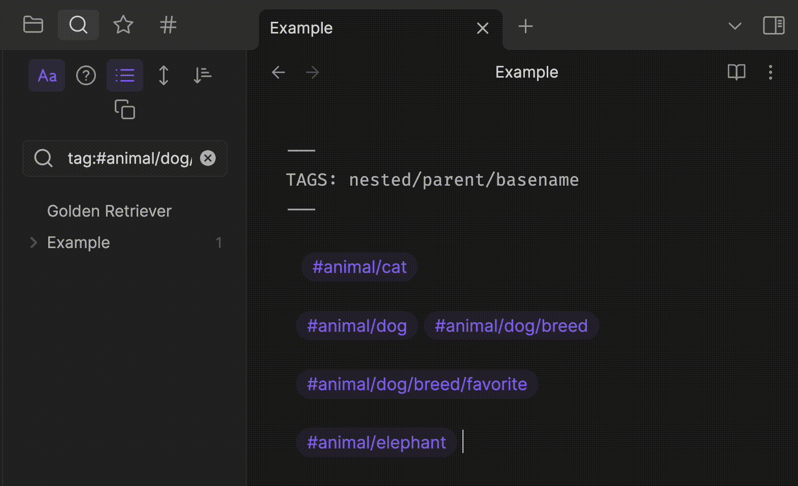

# Obsidian Base Tag Renderer

This plugin renders only the basename for tags in preview mode while maintaining the nested strucutres elsewhere.

It also appends a new class name (`basename-tag`) so it's possible to add custom style to it. 



The custom css applied for the above example -

```css
a.basename-tag[href*="animal"]::before{
    content: "😍 ";
}
a.basename-tag[href*="cat"]::before {
    content: "🐱 ";
}
a.basename-tag[href*="dog"]::before {
    content: "🐶 ";
}
```
